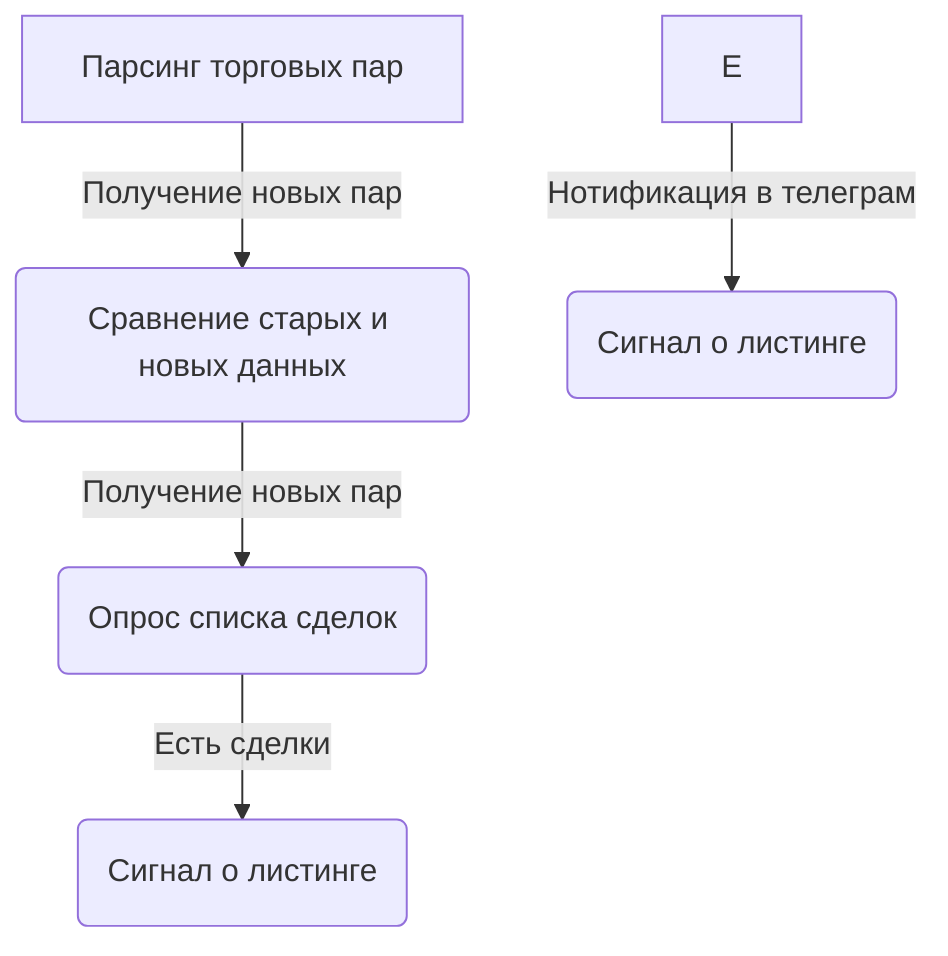

# Поиск новых листингов торговых пар
- парсим постоянно торговые пары со всех бирж
- делаем сравнение старых данных с новыми и находим новые торговые пары, которые появились в api биржи. Но это не значит, что она начала торговаться, а только намерение биржи ее добавить. Это может произойти как через 5 минут, так и через 2 месяца. Мы получаем сигнал о возможном листинге.
- поэтому на эти торговые пары запускается опрос списка сделок. если они есть, то мы получаем сигнал о листинге
- в ui делаем список для этих двух сигналов с кнопками перехода на торговлю этой парой
- нотификация в телеграм

# Как использовать:
- если планируется листинг на бирже второго эшелона (okex, kucoin), то берем монету на старте продаж, либо на биржах третьего эшелона
- если планируется листинг на бирже первого эшелона, то берем монету на любых других биржах
- либо ждем начала торгов на этой бирже и сразу покупаем монеты для последующей реализации

# Схема drawio

# Mermaid схема

